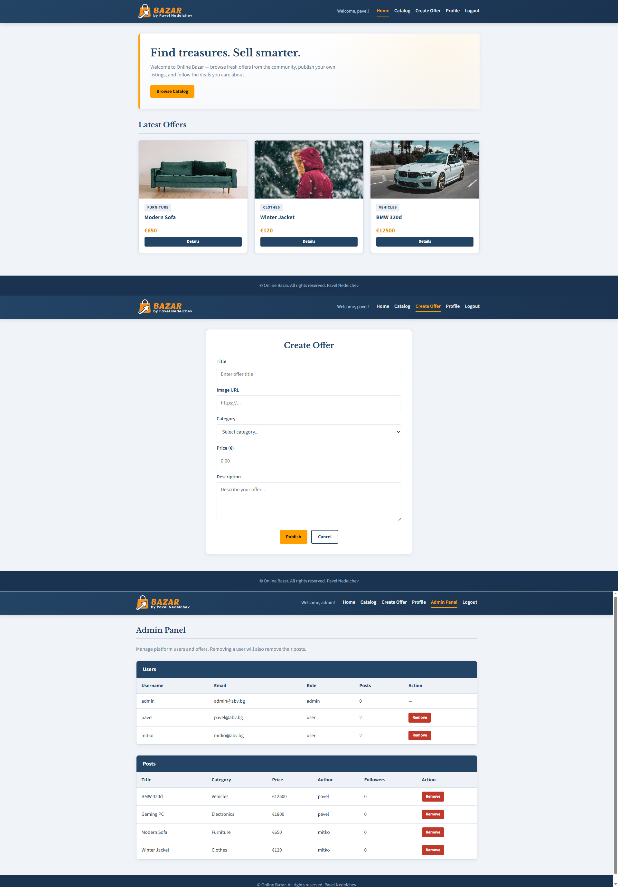

# BAZAR PROJECT by Pavel Nedelchev

### This is a project that includes the following technologies:
- Node.js;
- Express.js;
- Handlebars;
- Prisma ORM;
- ZOD validation;
- JSONWebToken;
- Bcrypt;

## Summary
The application has a seed script that loads 4 listings with implicit owner relations to 2 users.\
The logged-in users can load all pages with authentication, they can do CRUD operations on their publications and can like publications that are not theirs.\
The users that are NOT logged in cannot load the Create, Edit, Delete functionality.\
In the seed script is added an admin profile, that can access an admin panel, which allows the admin to delete users and listings.\
There is a single REST API endpoint showing the latest 3 listings (api/posts/top).\

The seeded users have the following login credentials:\
| EMAIL    | PASSWORD |
| -------- | ------- |
| admin@abv.bg | admin123 |
| pavel@abv.bg | pavel123 |
| mitko@abv.bg | mitko123 |

## How to start
Download the project and open it in a code editor(like VSCode).
Run the following commands:
1. npm install
2. npx prisma migrate dev
3. npx prisma db seed
4. npx prisma generate
5. npm run dev - to start the server

I have left the .env.example file - you will have to edit it's name to just ".env".\
You can change the DATABASE_URL & JWT_SECRET as you wish.
